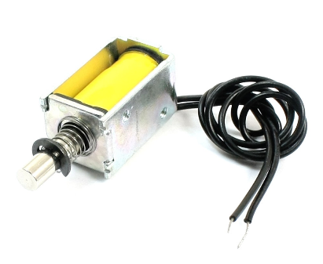

# S63_Arduino : Ressusciter un téléphone à cadran S63 avec un Arduino et un player MP3

Table des matières
==================

   * [introduction](#introduction)
   * [la mission : un téléphone musical qui vous joue un tube de votre année de naissance !](#la-mission--un-téléphone-musical-qui-vous-joue-un-tube-de-votre-année-de-naissance-)
   * [mission (im)possible ?](#mission-impossible-)
   * [commençons par le facile : la lecture de fichiers MP3](#commençons-par-le-facile--la-lecture-de-fichiers-mp3)
   * [plus compliqué, le S63](#plus-compliqué-le-s63)
   * [ça se complique encore (et on s'émerveille <g-emoji class="g-emoji" alias="sparkles" fallback-src="https://github.githubassets.com/images/icons/emoji/unicode/2728.png">✨</g-emoji>) avec le cadran](#ça-se-complique-encore-et-on-sémerveille-sparkles-avec-le-cadran)
* [des fils, des connexions, un peu de code et la magie prend forme](#des-fils-des-connexions-un-peu-de-code-et-la-magie-prend-forme)
   * [plan de connexion](#plan-de-connexion)
* [le code, justement](#le-code-justement)
   * [spécifications / comportement attendu](#spécifications--comportement-attendu)
   * [plus de détails sur le code ?](#plus-de-détails-sur-le-code-)
* [la carte micro SD et le module MP3](#la-carte-micro-sd-et-le-module-mp3)
   * [adaptation à notre cas d'usage](#adaptation-à-notre-cas-dusage)
   * [et les tonalités ?](#et-les-tonalités-)
      * [copyright ?](#copyright-)
* [c'est bien beau, ça marche, mais c'est pas pratique pour tout mettre dans le S63](#cest-bien-beau-ça-marche-mais-cest-pas-pratique-pour-tout-mettre-dans-le-s63)
* [un shield ?](#un-shield-)
   * [comment on fait un shield ?](#comment-on-fait-un-shield-)
   * [je peux en avoir un ?](#je-peux-en-avoir-un-)
* [et alors, ça fait quoi à la fin ?](#et-alors-ça-fait-quoi-à-la-fin-)
   * [et pour le mettre dans le S63 ?](#et-pour-le-mettre-dans-le-s63-)
* [On va plus loin ? On peut le faire sonner ?](#on-va-plus-loin--on-peut-le-faire-sonner-)
   * [un solénoïde ?](#un-solénoïde-)
   * [pilotage du solénoïde avec l'Arduino](#pilotage-du-solénoïde-avec-larduino)
   * [et du coup, coté shield, ca donne quoi ?](#et-du-coup-coté-shield-ca-donne-quoi-)
   * [et coté code et comportement attendu ?](#et-coté-code-et-comportement-attendu-)
   * [donc il faut ajouter une chanson dans la carte SD](#donc-il-faut-ajouter-une-chanson-dans-la-carte-sd)
* [responsabilités](#responsabilités)
* [envie d'aller plus loin ?](#envie-daller-plus-loin-)
* [Questions / Réponses / Divers](#questions--r%C3%A9ponses--divers)
   * [A quoi sert le 4e fil du cadran ?](#à-quoi-sert-le-4e-fil-du-cadran-)
* [Remerciements et références](#remerciements-et-références)


## introduction 

Commençons par rendre à César...

Ce projet a démarré lorsque j'ai vu un prototype de Socotel S63 que mon ami [Cyril Jovet](https://github.com/sun-exploit "Cyril Jovet") a fait revivre, vraisemblablement grâce au code de [revolunet](http://github.com/revolunet/s63 "@revolunet").

Merci à vous deux ! 

C'est donc en voyant un vieux vieux téléphone revivre avec un Raspberry que je me suis lancé le défi de faire fonctionner un S63 avec un Arduino. 

***Pourquoi ?***

Pour le challenge, pour découvrir plein de choses : faire du son, jouer des mp3, s'interfacer avec du matériel vintage, créer un shield Arduino, et aussi pour avoir une solution "plus simple", moins puissante qu'un Raspberry (luxueux, d'après moi, pour répondre à ce besoin), et pour diviser les couts de matériel/fabrication par 10 ! 

***Mais encore ?***

C'est aussi une expérience personnelle de transmission de compétences, de vulgarisation du code, d'initiation aux Arduino et à l'électronique.

C'est pourquoi cette page est particulièrement longue : au delà de l'évident partage Open Source, j'essaie de retracer tout mon parcours, montrer tout ce que j'ai appris et l'émerveillement que cela m'a apporté. Et aussi de permettre à un maximum de personnes de découvrir et comprendre comment ça marche !


## la mission : un téléphone musical qui vous joue un tube de votre année de naissance !

L'idée est à la fois géniale et très simple : utiliser un S63 pour numéroter son année de naissance (4 chiffres), et le téléphone joue alors une chanson emblématique de cette année là (et celle là, c'était en 1976, pour l'anecdote :grimacing:)

Une fois encore, ce n'est pas *mon* idée, et je ne sais pas exactement qui l'a eue. Je me suis contenté de produire une solution qui reproduit ce fonctionnement, avec un Arduino. 


## mission (im)possible ? 

Avant toute chose, il faut savoir si le projet est réaliste. Et pour celà, je vois 3 difficultés :
  - jouer un MP3 avec un Arduino
  - capter les impulsions d'un cadran téléphonique
  - arriver à faire marcher le tout ensemble, Arduino, S63, MP3, décrocher, raccrocher, numéroter, etc...

### commençons par le facile : la lecture de fichiers MP3

Quelques recherches sur Internet, et cela semble assez simple : 
  - le hardware : https://www.dfrobot.com/wiki/index.php/DFPlayer_Mini_SKU:DFR0299
  - le software : https://github.com/DFRobot/DFRobotDFPlayerMini/

Un peu plus de recherches (histoire de voir que ce module se trouve aussi un peu partout sous le nom de "MP3-TF-16P", une carte bleue qui chauffe (pas beaucoup, moins d'1€ !), et il n'y a plus qu'à attendre la livraison !

Pas de surprise, on cherche le schéma de montage (https://www.dfrobot.com/wiki/index.php/DFPlayer_Mini_SKU:DFR0299#Connection_Diagram). 

On assemble, [on bricole un peu avec la carte micro SD](#la-carte-micro-sd-et-le-module-mp3), et... ça marche :-)

### plus compliqué, le S63

J'ai sous la main un vieux téléphone à cadran et... Internet ! J'ai longuement cherché de la documentation sur le câblage et le fonctionnement du téléphone (et plus précisément du cadran), mais force est de constater que je n'ai rien trouvé de bien probant. Finalement, c'est bien [revolunet](http://github.com/revolunet/s63) qui est le plus clair et le plus complet dans tout ce que j'ai pu trouver sur le S63.

C'est pas mal, ça peut me permettre de démarrer, mais dans le doute j'ai quand même ouvert mon S63, pour le passer au multimètre et me faire mon opinion.

Pas de surprise, et effectivement, je confirme quelques informations capitales de [revolunet](http://github.com/revolunet/s63) : 
  - on détecte le décrocher/raccrocher via les connexions 7 et 11 du S63
  - le haut parleur est sur les connexions 3 et 5 (et les 2 et 4 aussi, pour l'écouteur supplémentaire, mais c'est déjà précablé)

### ça se complique encore (et on s'émerveille :sparkles:) avec le cadran 

Le S63 est une merveille d'ingénierie, et son cadran l'est encore plus.

Je fais ici un petit aparté : 

*En tant qu'ingénieur travaillant chez Orange, j'avais un peu l'impression, en inspectant ce téléphone,
de passer sur les traces de mes pairs, et j'avoue que j'ai senti une grande fierté de faire partie
de la grande famille de l'ingénierie chez l'opérateur historique. Je souhaite ici rendre 
hommage à mes illustres prédécesseurs : La qualité de fabrication du S63 (sa longévité en témoigne) sa
simplicité d'utilisation et l'ingéniosité des mécanismes (en particulier le cadran) forcent le respect.*

Le cadran est, donc, une merveille. Hélas, 4 fils en sortent et il y en a un dont je n'ai pas réussi à percer le mystère.

Mais avec mon multimètre (et l'aide de http://jla.1313-blog.overblog.com/2017/09/convertisseur-dc/dtmf.html) voici comment fonctionnent les 3 autres :
  - **I   : les impulsions téléphoniques (66ms toutes les 100ms, désolé, je retrouve plus ma source :cry: )**
  - **II  : la masse**
  - **III : interrupteur ouvert lorsqu'un chiffre est en cours de composition (lorsqu'on tourne le cadran).**
  
NB : oui le S63 propose un marquage en chiffres romains pour les fils du cadran, pour se démarquer et éviter de confondre avec l'autre bornier. Cela va me causer quelques soucis plus tard, car il est facile de confondre 11 et II (j'y reviendrai).

Autre petit aparté : 

*le cadran fonctionne avec un ressort. Comment faire pour que lorsqu'on compose un 0
le cadran aille à la même vitesse (et envoie donc les impulsions de même durée) que lorsqu'on compose un 1, 
alors que le ressort sera beaucoup plus remonté ?*

*Les ingénieurs ont pensé à un mécanisme très simple mais incroyablement efficace, un régulateur de vitesse !
Je vous laisse lire et voir les photos ici : http://jla.1313-blog.overblog.com/s-63-a-cadran-sur-freebox*

Reste à voir si mon Arduino va réussir à détecter correctement les impulsions.


## des fils, des connexions, un peu de code et la magie prend forme 

Une fois les fils correctement identifiés, la connexion est plutôt simple. 

On va se servir des [pullup](https://www.arduino.cc/en/Tutorial/DigitalPins "résistances de pullup des Arduino") pour nous simplifier la vie sur la détection du "décrocher/raccrocher" et du "numérotation en cours". 

Pour les impulsions du cadran, on va brancher le fil concerné (le I donc) sur la patte 2, qui permet de gérer les [interruptions](https://www.arduino.cc/reference/en/language/functions/external-interrupts/attachinterrupt/ "interruptions"), ce qui est nécessaire pour éviter de louper une impulsion. En résumé, une interruption intervient chaque fois qu'une impulsion est détectée, et déclenche un morceau de code (appelé "callback"), qui va incrémenter un compteur.

Pour le haut parleur, on connecte les pattes SPK1 et SPK2 du player MP3 aux bornes 3 et 5 du S63.

Une petite subtilité : pour le "décrocher/raccrocher", une partie du circuit électrique du S63 est reliée au cadran. J'ai constaté que cela posait problème si la borne 7 n'était pas connectée à la masse. Dont acte, c'est donc la borne 11 qui transmettra le signal "décrocher/raccrocher".

### plan de connexion

:exclamation: NB : comme déjà évoqué précédemment, il est très facile de confondre 11 et II, soyez vigilants dans vos montages !  

|Arduino |    S63   |    MP3
|--------|----------|----------
| 2      |    I     |
| 4      |   III    |
| 5      |    11    |
| 10     |          |   TX
| 11     |          |   RX (+1k&ohm; resistor en serie)
| +5V    |          |   VCC
| GND    |  II / 7  |   GND
|        |    3     |   SPK1
|        |    5     |   SPK2


On peut même imaginer/anticiper un bornier sur la breadboard (*spoil : ou anticiper la fabrication un circuit imprimé !*), ainsi :

| breadboard |    S63   |
|------------|----------|
| 1  (gauche)|    11    |
| 2          |    III   |
| 3          |     I    |
| 4          |     3    |
| 5          |     7    |
| 6          |     5    |
| 7 (droite) |     II   |


Et un schéma associé (merci [Fritzing](https://fritzing.org "Fritzing"))


Et voilà ! La magie opère, avec mon petit code de test, j'entends bien un MP3 dans le combiné ! :heart_eyes:

Et pareil en testant le décrocher/raccrocher, le cadran qui numérote, et ... les chiffres / impulsions ! Le code avec les interruptions fonctionne à merveille !


## le code, justement

C'est bien beau, on a un code de test, on arrive à détecter les actions physiques sur le téléphone, et à jouer un (unique) morceau de musique dans le combiné.

### spécifications / comportement attendu 

Nous allons donc maintenant nous lancer dans la partie "faire revivre" le téléphone. Il va donc falloir coder le fonctionnement suivant :
  - lorsque le téléphone est raccroché, rien ne se passe, et cela le remet dans son état initial
  - lorsqu'on décroche, on entend la tonalité pendant 10 secondes
    - si au bout de ces 10 secondes, aucun chiffre n'est composé, on joue la tonalité d'occupation puis on attend indéfiniment (il faut donc raccrocher)
    - si un chiffre est composé pendant les 10 secondes, alors :
      - on arrête la tonalité
      - on mémorise ce chiffre 
      - on attend 10 secondes avant de lancer l'appel (pour permettre de numéroter un autre chiffre)
    - si on a saisi 4 chiffres alors on réduit fortement le délai d'attente pour lancer rapidement l'appel, car on a là une année de naissance, à priori. Donc plus besoin d'attendre un nouveau chiffre numéroté.
  - on vérifie que l'appel va aboutir :
    - est-ce que la date de naissance est valide ?
    - est-ce que sur la carte mémoire, nous avons un dossier contenant des mp3 pour cette année ?
    - en cas de réponse négative à l'une des deux questions, on joue la tonalité d'erreur et on arrête tout (il faut alors raccrocher)
  - on lance l'appel :
    - on simule un appel longue distance, on joue donc la tonalité d'acheminement pendant 3 secondes
    - on joue ensuite la tonalité de sonnerie pendant 6 secondes
    - puis... on décroche et on joue une chanson aléatoire parmi celles qui sont disponibles dans le dossier correspondant à l'année composée.


***Simple, non ?***

En fait, pas tant que cela, vu qu'on utilise un micro-contrôleur, et donc que le code est dans une boucle infinie. 
J'ai donc opté pour une "machine à état". Je mémorise l'état dans lequel le téléphone est actuellement, et je teste cet état afin de jouer le bon morceau de code en fonction de la situation.

### plus de détails sur le code ? 

"La vérité est dans le code" comme on dit souvent :smiley: (en tout cas, chez moi on le dit :grimacing:)

Si vous voulez en savoir davantage, le code implémente exactement le fonctionnel vu ci-dessus, est massivement documenté et j'espère qu'il est lisible ! Je suis preneur de tout commentaire, retour, amélioration, évidemment !

Et le code, évidemment, il est là : [socotel](./socotel/socotel.ino)


## la carte micro SD et le module MP3

[Le module MP3](#commen%C3%A7ons-par-le-facile--la-lecture-de-fichiers-mp3) est formidable (pour son prix) ! Il inclut :
- un lecteur de carte micro SD
- un décodeur MP3
- un convertisseur analogique (DAC)
- un égaliseur (equalizer)

Hélas, il a quelques limitations, qui nous obligent à quelques contorsions dans le code. Les voici :
  - les dossier doivent être **exclusivement** composés de 2 chiffres  (01-99)
  - les fichiers doivent être **exclusivement** composés de 3 chiffres (001-255)
  - il y a un cas particulier pour les 10 premiers dossiers, qui peuvent prendre des fichiers dans l'intervalle 0001-1000 (avec un appel à une fonction différente, hélas)
  - il y a deux dossiers spéciaux "MP3" et "ADVERT", qui acceptent des fichiers dans l'intervalle 0000-65535, qui utilisent une fonction différente des dossiers standard pour y accéder. Et dans le cas de "ADVERT", la musique précédant l'appel reprend après la fin du son joué (c'est manifestement une fonction utilisée dans les commerces pour faire de la pub, puis reprendre la chanson là ou elle était...).

### adaptation à notre cas d'usage

Dans notre cas, nous voilà bien embêtés, car il est impossible de stocker les années simplement. Nous allons donc nous donner 100 ans glissants, et choisir à quel moment on change de siècle entre les dossiers 01 et 99. 

Dans le code, j'ai opté pour une plage de fonctionnement entre 1940 et 2017 inclus. En conséquence, le dossier 01 est pour 2001, le 17 pour 2017, le 40 est pour 1940, le 99 pour 1999.

Reste le cas de l'an 2000, vu que le module n'accepte pas le dossier "00". (tiens, ça faisait longtemps qu'on avait pas eu un bug de l'an 2000 ! :grimacing:)

Qu'à cela ne tienne, vu qu'entre 2017 et 1940 j'ai 32 dossiers libres, je vais en utiliser un, disons 1940-1 => 39 comme dossier pour l'an 2000... 
Oui, c'est très moche, j'ai honte :sweat:, tout ça... mais c'est surement le moins compliqué à implémenter dans le code.

Pour le reste, ça devient simple, un dossier par année, des fichiers numérotés pour chaque dossier et c'est parti :
```
  40/001.mp3
  40/002.mp3
  40/003.mp3
  41/001.mp3
  41/002.mp3
  ...
```
**cela va sans dire...** : mais pour des raisons évidentes de droits d'auteur, je ne fournis évidemment aucun fichier mp3 relatif aux chansons et années. A vous de déposer vos fichiers préférés dans les dossiers correspondants (et avec les numéros ad-hoc). 

**Petit bonus** : le code que je fournis gère de lui même le nombre de fichiers dans les dossiers et en choisit un au hasard au moment de jouer la musique. Pas la peine d'avoir le même nombre de chansons dans chaque dossier, donc.

### et les tonalités ?

Les tonalités sont dans le dossier spécial ["MP3"](./microSD_content/MP3).
- 0001.mp3 => tonalité d'accueil (le son continu lorsqu'on décroche, avant de numéroter)
- 0002.mp3 => tonalité d'occupation
- 0003.mp3 => tonalité d'acheminement
- 0004.mp3 => tonalité de sonnerie
- 0005.mp3 => tonalité d'erreur d'acheminement.

Vous retrouverez tous ces fichiers et l'arborescence décrite ci-dessus dans le dossier [microSD_content](./microSD_content/) de ce dépôt.

#### copyright ?

Mais d'où viennent ces MP3 de tonalités ? 

Là, je tiens à remercier https://www.orange.com/fr/content/download/3635/33162/version/1/file/STI03-ed4_0505.pdf, qui décrit toutes les spécifications des tonalités de l'époque !

A partir de ces spécifications, j'ai moi même reproduit ces sons grâce à l'excellent [Audacity](https://www.audacityteam.org), avec lequel c'est d'une simplicité incroyable de générer des sons lorsqu'on connait les durées et les fréquences. :thumbsup:

Du coup... ces MP3 sont les miens. Je les mets à disposition de ce programme, et sous licence GPL, évidemment. :sunglasses:


Nouvel aparté : 

*la tonalité d'accueil du téléphone (le fichier [0001.mp3](./microSD_content/MP3/0001.mp3)) est un "La 3" comme l'appellent les musiciens. C'est un signal sonore de fréquence 440Hz. Sa particularité ? C'est **LE** "La", celui qu'on entend au diapason, celui qu'on utilise pour accorder un instrument !*
*Eh oui, en cas de besoin, on pouvait se servir d'un téléphone pour s'accorder ! Quel heureux hasard ! Ou plutôt, merci à ceux qui l'ont conçu comme cela !*

 
## c'est bien beau, ça marche, mais c'est pas pratique pour tout mettre dans le S63

Oui... à ce stade du projet, on a un montage qui fonctionne, du code qui reproduit le fonctionnement de l'époque et une carte mémoire avec tout ce qu'il faut.

Souci, ça fait des fils partout, c'est pas super pratique, ça va se débrancher et ça va pas rentrer dans le S63.

Du coup, c'est là qu'on va parler des [shields](https://www.arduino.cc/en/Main/arduinoShields) !


## un shield ?

Un shield c'est un circuit imprimé qui est exactement de la taille de l'Arduino, avec les mêmes connexions et qui vient se brancher au dessus de lui. 

Cela permet, notamment, d'inclure des circuits, connexions et autres sur un circuit imprimé, qui va se fixer sur les pattes de l'Arduino, et donc éviter d'avoir plein de fils volants, et mieux, d'éviter d'avoir quoi que ce soit à câbler ! 

On prend le shield, on le fixe et... ça marche !

Bon... dans notre cas, il va falloir quand même souder les connexions au S63. Mais toutes les connexions au lecteur MP3 vont être intégrées.

L'avantage c'est qu'on évite les plaques à essais, les fils volants et qu'on gagne de la place !

L'autre avantage, c'est qu'on ne peut plus se tromper dans le câblage (ou presque ... [rappelez vous du 11 vs II !](#plan-de-connexion) )

Concrètement, le shield pour notre projet, cela ressemble à ça : 

 

et à ça : 

 


### comment on fait un shield ?

Concrètement, j'ai documenté mon montage dans [Fritzing](https://fritzing.org "Fritzing") (voir [plan de connexion](#plan-de-connexion), et grâce au même outil, j'ai ensuite conçu le schéma du shield et son routage électrique.

J'ai alors exporté le résultat dans un format exploitable par les professionnels du circuits imprimé (le format "gerber") que j'ai ensuite fait imprimer/fabriquer. 


### je peux en avoir un ?

Si vous voulez vous faire votre shield, vous trouverez tout ce qu'il faut pour l'imprimer (format gerber, donc) dans le dossier [shield](./shield). Vous trouverez facilement sur internet des sites pour imprimer des circuits (cherchez "PCB maker").

Si vous préférez, j'ai un peu de stock et je peux vous faire parvenir un shield (nu évidemment, à vous de vous procurer et souder les composants), moyennant le remboursement des frais de transport et de fabrication. [Contactez-moi si besoin](https://twitter.com/thomas_chappe)

Concernant les pièces à ajouter / souder, il vous faudra : 
  - [un lecteur MP3](#commen%C3%A7ons-par-le-facile--la-lecture-de-fichiers-mp3), évidemment.
  - une résistance de 1k&ohm;
  - des connecteurs pour shield [de ce genre là (par exemple)](https://snootlab.com/connecteurs/170-kit-connecteurs-empilables-arduino-1.html)
  - des fils électriques de base (j'ai une préférence pour les fils multicolores "Dupont") pour connecter le S63 au shield.
  - optionnellement, des "cosses fourche" pour se brancher proprement coté S63.


## et alors, ça fait quoi à la fin ?

A la fin, ça ressemble à ça (ancienne version du shield mais même principe) : 


et lorsqu'on l'empile sur un Arduino :


### et pour le mettre dans le S63 ?

Pensez à acheter un adaptateur 230v-9v pour Arduino, afin de l'alimenter directement sur une prise secteur. Il n'y a alors qu'un petit fil à faire sortir du S63 pour qu'il fonctionne.

Et mettez votre montage (Arduino + shield) dans un emballage antistatique (en général les Arduino sont vendus emballés dedans) afin de ne pas faire de court-circuit avec l'intérieur du S63.


## On va plus loin ? On peut le faire sonner ?

Oui ! :smiley:

Dans la version 2.0.0 du code, une partie **optionnelle** a été ajoutée, ainsi qu'un shield approprié [version 2.5.0](./shield/socotel_arduino_shield_gerber%20(with%20bells)%20v2.5.0.zip) pour faire sonner le S63.

J'ai bien dit **optionnelle** : tout ce qui est décrit avant fonctionnera parfaitement avec la dernière version du code ou du shield, même si vous ne mettez pas en place les élément décrits ci-dessous et que vous ne voulez pas faire sonner le téléphone.

J'ai pris l'initiative de ne PAS utiliser le moteur et le carillon d'origine du téléphone, car il fonctionne en 48V (d'après les informations que je trouve sur le net...) et que je n'avais pas envie de gérer un transformateur électrique (cout, encombrement...), ou pire, faire entrer du 230V dans le téléphone.

Du coup, un collègue (:wave: Yann G, si tu me lis !) m'a soufflé une excellente idée : utiliser des solénoïdes !

C'est un peu dommage car on ne réutilise pas l'existant, mais c'est beaucoup plus sûr que de jouer avec le courant !

### un solénoïde ? 

Oui, des solénoïdes ! Ces petites bobines qui font se déplacer un percuteur ! 
Une photo (merci AliExpress !) vaut mieux qu'un long discours : 


Du coup, il suffit d'en placer un à coté de chacune des cloches du téléphone, de les fixer à la distance adéquate avec un pistolet à colle et le tour est joué... ou presque ! Il faut les piloter avec l'Arduino maintenant !

### pilotage du solénoïde avec l'Arduino

Un solénoïde (une bobine), ça consomme pas mal de courant. Et donc les pattes des Arduino, avec leurs 50mA maximum, ça va pas suffire.

Du coup, il faut brancher le solénoïde directement sur le +5V de l'Arduino (qui fournit beaucoup plus de courant et est directement relié à l'alimentation de l'Arduino). Oui, mais là... on ne le pilote plus !

C'est là qu'arrive encore un nouvel ami électronique : le transistor ! 

Dans notre cas, il va servir d'interrupteur. Je ne rentre pas dans les détails (d'ailleurs, je ne maitrise pas tout !) mais en gros, si on envoie du courant sur la base (B) d'un transistor, alors entre l'émetteur (E) et le collecteur (C), le courant passe. 

Un transistor, cela a donc 3 pattes, et ça ressemble à ça : 


Parfait ! Il suffit alors de brancher la base sur une patte de notre Arduino, et de faire un circuit électrique entre le +5V, le solenoïde, et le transistor pour pouvoir programmer tout ça !

Bon il faut une résistance et une diode en plus, pour des histoires de spécifications et de retour de courant, mais c'est des détails (ou pas, ça peut griller votre Arduino si vous les mettez pas...).

### et du coup, coté shield, ca donne quoi ?

Comme dit précédemment : ces composants sont **optionnels** et ne servent **que** pour faire sonner le téléphone.

Partez de la [version 2.5.0 du shield](./shield/socotel_arduino_shield_gerber%20(with%20bells)%20v2.5.0.zip) pour avoir tous les circuits nécessaires. 

Concernant les pièces à ajouter et souder pour que cela sonne, il vous faudra : 
  - 2 résistances de 1k&ohm;
  - 2 diodes 1N4004
  - 2 transistor TIP102
  - 2 solénoïdes 5V [exemple ici](https://www.aliexpress.com/item/32801392552.html)


Et le montage complet, concrètement, c'est ça : 


### et coté code et comportement attendu ?

J'ai ajouté un comportement supplémentaire dans le code : 
- si on compose un numéro spécial (par défaut c'est le 0666 :metal:)
	- le téléphone joue MP3 spécial (pour indiquer à l'utilisateur que la consigne est bien reçue). 
	- Lorsque le téléphone est raccroché, alors il attend un délai (paramétrable), 
	- puis... il sonne !
- Lorsque vous décrochez, il reprend son fonctionnement normal : tonalité habituelle, attente de la numérotation d'une année.
- Si vous ne décrochez pas, il s'arrête de sonner après un nombre de sonneries paramétrable dans le code.

**Petit bonus** : Bien évidemment, j'ai à nouveau récupéré les spécifications et durées des sonneries d'époque, et ce sont donc les durées d'origine (et leur nombre) qui sont utilisées par défaut dans le code ! Vous allez voir (ou entendre plutôt !), ça rappelle des souvenirs de l'entendre sonner !

### donc il faut ajouter une chanson dans la carte SD

Oui, un fichier MP3 de votre choix pour que le téléphone vous indique que votre appel au numéro spécial a bien été pris en compte.

Comme expliqué précédemment, les tonalités sont dans le dossier spécial ["MP3"](./microSD_content/MP3).

Il faut donc y ajouter un fichier : 
- 0006.mp3 => son de prise en compte de demande d'appel / sonnerie


## responsabilités 

Je suis un bricoleur / bidouilleur / geek / passionné, mais je ne suis pas un professionnel de l'électricité ni de l'électronique. Il est donc possible qu'il y ait des imperfections ou défauts dans toute cette expérimentation. Il est également possible que les modules utilisés soient défaillants ou fonctionnent de manière inattendue. 

En utilisant les différents éléments et informations proposés ici, vous engagez votre propre et entière responsabilité et je ne saurai être retenu responsable de quelque conséquence que ce soit pour l'utilisation des éléments que je fournis ici.

Merci pour votre compréhension, vive l'Open Source et vive le partage de connaissances !


## envie d'aller plus loin ?

Je me suis arrêté là pour cette expérimentation, qui me semble déjà bien complète et qui m'a occupé bien plus longtemps que ce que je ne l'imaginais !

Cependant, j'avais encore quelques idées, peut-être que j'y reviendrai plus tard, mais en attendant, s'il y a des personnes qui veulent reprendre le flambeau, les voici : 
  - remplacer les mp3 de tonalité par des appels à la fonction [tone de l'Arduino](https://www.arduino.cc/reference/en/language/functions/advanced-io/tone/)
  - <del>brancher la sonnerie du téléphone (voir ce que fait [revolunet](http://github.com/revolunet/s63 "@revolunet") à ce sujet) mais c'est assez dangereux (230v etc...)</del> Voir juste au dessus ! [On va plus loin ? On peut le faire sonner ?](#on-va-plus-loin--on-peut-le-faire-sonner-)
    - inventer un cas d'usage où il serait intéressant de le faire sonner, aussi...
  - remplacer l'Arduino par un ESP8266 pour permettre une connectivité wifi et ouvrir une toute autre dimension (pilotage d'API sur internet, modifier/ajouter des mp3 sur la carte microSD à distance, IoT, allumer la lumière, communiquer à plusieurs téléphones, voire communication VoWifi ?). 
    - cela nécessite certainement de revoir le shield car les pattes des ESP8266 sont différentes de celles de l'Arduino...
  - Adapter la fiche T du téléphone pour alimenter le circuit directement avec cette prise ou à défaut, la couper et réutiliser le fil, pour éviter d'ajouter un fil qui sort du S63 pour l'alimenter.
  - <del>trouver à quoi sert le 4e fil du cadran</del> voir ci dessous [A quoi sert le 4e fil du cadran ?](#à-quoi-sert-le-4e-fil-du-cadran-)
  - ajouter une prise jack pour pouvoir connecter une enceinte et transformer le téléphone en player mp3, avec un code alternatif :
    - stocker des playlist dans les dossiers
    - lorsqu'on compose un numéro (1 ou 2 chiffres), cela joue la playlist (tout les mp3 du dossier numéroté).


## Questions / Réponses / Divers
### à quoi sert le 4e fil du cadran ?
"Son rôle est de shunter la sonnerie pour éviter les tintements de celle-ci lors de la numérotation. La sonnerie est alimentée normalement par du 80v alternatif envoyé par le central (c'était du 110v dans les premiers centraux). Le condensateur en entrée bloque le 48v continu fourni par la ligne et laisse passer le courant d'appel. Lors de la numérotation, l'ouverture/fermeture de la ligne par le cadran passe le condensateur et fait tinter la sonnerie. Le shunt permet d'éviter ça. Celui-ci est d'ailleurs déporté au niveau du conjoncteur par le fil rouge (borne 17 sur le S63 de mémoire) pour la sonnerie extérieure et via le câblage la sonnerie des autres postes montés en parallèle s'il y en a." [Jacques-F](https://github.com/ThomasChappe/S63_Arduino/issues/2#issuecomment-2427249708)

## Remerciements et références

  - [Cyril Jovet](https://github.com/sun-exploit "Cyril Jovet") évidemment, sans qui je n'aurais jamais découvert l'idée d'adapter un S63
  - [@revolunet](https://github.com/revolunet "@revolunet") pour l'idée originale et la documentation (schémas, images) sur son github
  - [@DFRobot](https://github.com/DFRobot/DFRobotDFPlayerMini/) pour sa bibliothèque de prise en charge du player MP3.
  - [Jacques-F](https://github.com/ThomasChappe/S63_Arduino/issues/2#issuecomment-2427249708) pour sa réponse à l'utilité du 4e fil du cadran.
  - http://jla.1313-blog.overblog.com/ : énorme base documentaire, découvertes et expérimentations qui m'ont passionné et bien aidé !
  - https://www.orange.com/fr/content/download/3635/33162/version/1/file/STI03-ed4_0505.pdf : toutes les spécifications des tonalités de l'époque !

et quelques compléments :
  - http://www.rennes.supelec.fr/ren/fi/elec/docs/telefon.htm
  - http://telecommunications.monsite-orange.fr/page-57573c36a13b9.html
